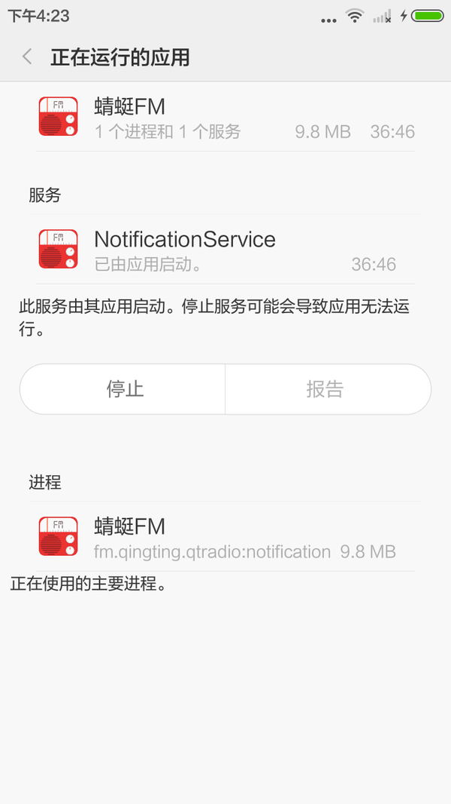
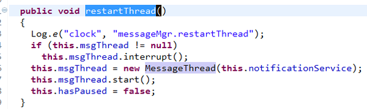
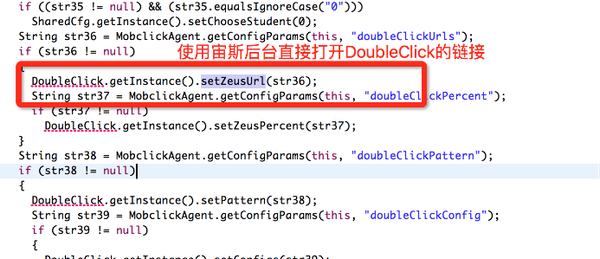
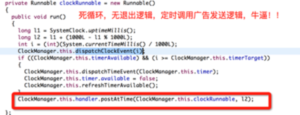

# 蜻蜓FM涉嫌诈骗投资人和广告主源代码剖析

本文主要内容，引用自知乎的这篇文章：[如何评价蜻蜓 FM 伪造用户活跃度等数据](http://www.zhihu.com/question/37248269)

感谢“左莫”、“任正”等热心正义的网友--左莫，任正的最早的回答猜测已经被蜻蜓FM通过创新工场关系让知乎删除了，而且此贴已经锁定，蜻蜓FM还在不停赞下面无关紧要的垃圾评论。希望大家一起站出来抵制这种造假和疑似诈骗的行为。

<b>蜻蜓FM是一款音频app，最近我反编译了他的源代码，主要原因是最近有篇文章： </b>


不过蜻蜓FM大量的删帖很多已经死链了，太无耻！还活着的链接：

<a href="http://mt.sohu.com/20151108/n425652249.shtml">蜻蜓造假黑科技新闻</a>

<font color="red" size="5">充满着好奇，黑科技是怎样做到的呢？？</font>

#  蜻蜓FM是如何提高DAU，欺骗友盟，talkingdata

## 摘要

看了蜻蜓FM的源代码，先总结一下它整个的工作原理：

1.	后台偷偷启动进程，开到让用户电量飞奔的最大限度，使得神蜻蜓FM在后台永活，作为android的我终于顿悟：为嘛老子的电量老是会这么快用完。
2.	永活的蜻蜓FM，会定时地执行“普罗米修斯神逻辑”，就是狂刷每日活跃用户数，秘密就是：打开用户看不到的透明界面，即使是用户在闭屏状态，这个神界面也会打开。
3.	“普罗米修斯神逻辑”执行时会给我们公正的第三方数据公司，发“用户打开了蜻蜓FM应用”这条通知，结果，第三方数据统计里，日活又加一个。
4.	蜻蜓FM接着将他的日活数据给到投资人，看看俺的1000万DAU，比QQ音乐还牛逼，砸个几亿吧。
5.	悲催的投资人，掏出了大笔的钞票给蜻蜓FM。

作为一个Android程序员，实在是看不惯这种行为，顺便提醒第三方数据公司和投资人，防止一些像蜻蜓FM这样无耻的创业公司欺骗大家。

## 具体步骤

具体听我细细道来：

首先来看一下我们打开蜻蜓App之后，它在后台跑的进程的数量：

 
5个进程，你没有看错是5个进程！！！而且这几个进程相互守护，无法彻底杀死，十双筷子哟，牢牢抱成团。到目前为止，从来没见过一款应用会起这么多进程。为了知道他为什么要启动这么多进程，我们怀着好奇的心，反编译了蜻蜓的app。结果发现了一些很奇怪的事情。

第一件事就是，他们的App代码居然没有混淆，开发人员真省事，阅读代码如同阅读源码。在我们阅读源码的时候，我们发现了今天的主角，关键进程：NotificationService


------- 
manifest.xml里面注册为：
```
<service android:name=".NotificationService" android:process=":notification">
 <intent-filter>
     <action android:name="fm.qingting.qtradio.NotificationService" />
     <category android:name="android.intent.category.DEFAULT" />
   </intent-filter>
</service> 
```

当然他也是个小强进程，无法彻底杀死！

通过反编译我们发现：
第一步：
NotificationService 会在onCreate方法里面调用MessageManager类的restartThread方法。


而restartThread方法中会启动一个叫MessageThread的线程



第二步：
我们看看神奇的MessageThread做了一些什么事


 
我们发现一个叫"执行普罗米修斯"execPrometheus的方法，智慧之神，看名字就觉得牛逼的一腿！我们再来看看他的实现，它最后调用了一个神奇的方法doPrometheus，当然中间有一些条件判断，比如多长时间“普罗米修斯”一下，例如：

 
 
最后我们来看看这个“普罗米修斯”的最后实现方法：
启动了一个ShieldActivity，当我们阅读ShieldActivity的源码惊奇的发现，这个activity居然什么事都没做，是个无界面的activity，类似透明窗口，并且2s之后销毁结束自己。

<b><font color="red" size="5"><a href="https://github.com/cryfish2015/QingTingFanBianYi/blob/master/QingTingFanBianYi/src/fm/qingting/qtradio/ShieldActivity.java">看ShieldActivity类源代码</a></font></b>


 
那这个打开的activity什么要做这个事呢？让你触目惊心，高DAU和启动次数的神话诞生了：


为了伪造DAU，欺骗umeng，talkingdata，艾瑞等知名第三方数据公司，增加虚拟活跃用户，他们智慧到了神的地步。自启动无窗口的透明activity界面调第三方数据公司的API。
为了证实这点，我还专门写了一个demo,在后台启动一个透明界面，发现umeng确实会把它算为活跃用户。今天我才发现，原来App还能这样提高自己的活跃用户，投资人的钱是这么好骗，这招确实高明，实在无言以对。

对源代码感兴趣的：


<b><font color="red" size="5"><a href="https://github.com/cryfish2015/QingTingFanBianYi/blob/master/QingTingFanBianYi/src/fm/qingting/qtradio/notification/MessageThread.java">看普罗米修斯实现源代码</a></font></b>

# 蜻蜓FM是如何提高广告展示量和点击量欺骗秒针，DoubleClick

## 摘要

继续阅读蜻蜓FM的源代码，会看到宙斯类，真有点扛不住，蜻蜓FM你太逆天了，你要创造整个世界啊！不多说了，直接上菜。
既发现蜻蜓牛逼的提升日活普罗米修斯Prometheus—智慧之神后，我们发现蜻蜓又一个牛逼闪闪的服务Zeus(宙斯，牛逼的上帝，无所不能)。蜻蜓你能让我的小心脏平定一会儿吗，又是上演好莱坞大片的节奏。

宙斯是蜻蜓FM用来欺骗广告主和第三方广告数据监测公司（秒针，admaster，doubleclick等）的系统：

1.	在用户的手机上会频频打开非常耗内存和电量的组件，webview—浏览器，将它设置到最小化，用户肉眼看不到。
2.	在看不到的webview—浏览器里，蜻蜓FM偷偷的打开了广告主广告图片
3.	蜻蜓FM偷偷的用户程序点击了这个广告图片
4.	将打开和点击的事件发给了第三方广告数据监测公司
5.	广告主掏腰包的时候，根据第三方数据，广告的展示量，点击数量被刷的好的离谱，连连称赞蜻蜓FM数据一级棒，点击率，转化率高，1千万花的值，下次我还找你合作哦，QQ音乐的合约免谈了
6.	蜻蜓FM老板，销售，产品，技术，投资人拿到1千万后，笑的合不拢嘴，发奖金吧，还等什么呢，这钱不就跟捡到的一样么？不知道你们这样诈骗合作方，是否睡得心安理得呢？

不揭露实在不行了，我们来看看里面到底干了什么？
 
## 步骤

<b><font color="red" size="5"><a href="https://github.com/cryfish2015/QingTingFanBianYi/blob/master/QingTingFanBianYi/src/fm/qingting/utils/Zeus.java">看zeus类源代码</a></font></b>

 

Zeus类里面主要新建了一个WebView（浏览器）对象，好像这并没有什么问题，但是你仔细观察发现，这个神奇的Zeus类，它并没有把webview对象添加到任何可见化界面上，比如常见的Activity/Fragment等。
那它为什么要在后台内存中放一个webview呢？要知道android的webview本身实现的并不好，存在大量的bug，开发过android的程序员大概都知道这点。这东西，耗电，耗内存。
继续分析，我发现两个关键函数setZeusUrl()和startZeus()，两个函数的实现如下：

 
 


看到这个我都惊呆了，原来伟大的宙斯是用来在后台偷偷的打开网页链接的。打开的网页链接用户还是看不到的。

那他为什么要这么做呢，对蜻蜓FM又有什么好处呢？

 
 
蜻蜓FM用一个看不见的浏览器打开广告主的网站，接着用程序模拟用户行为点击。广告的展示率和点击率，顿时提高了一个数量级，原来广告商的钱也这么好骗！
看到这里，我真是佩服蜻蜓FM的老板，销售，产品，程序员，你们确实很聪明，我怎么就没想到呢？聪明的人赚钱真的很容易，违法么，不知道，我们改天都投递简历到蜻蜓吧，涨姿势。

悲催的DoubleClick等广告数据监测公司都被这位亲密的伙伴蒙在鼓里，要阻止这样的流氓公司，广告主纷纷站起来说臣妾做不到啊，臣妾不给你上了！
DoubleClick是美国一家网络广告服务商，主要从事网络广告管理软件开发与广告服务，对网络广告活动进行集中策划、执行、监控和追踪。

 

随时宙斯源码阅读的进一步深入，我越来越不敢相信自己的眼睛，我们再来看看他们给第三方广告公司(比如秒针、AdMaster之类)发送数据的类ThirdTracker，同样有惊人的发现。
ThirdTracker里面有给各大第三方广告公司发送数据的代码逻辑，如下：

 
 
从上图一看，各大第三方广告数据公司齐聚宙斯系统，我们和骗神蜻蜓FM一起创造世界吧。

我们再来看看这些广告是怎么被蜻蜓FM触发启动的：
 

 

这个方法的调用者为RootNode类的onClockTime方法（闹钟 吐槽:这位开发兄弟，你能不能不起这么直白的名字，你老板的内裤都被你暴露了），但从这个方法的名字来看，就感觉这个类有问题，是不是每间隔一段时间，后台偷偷给广告商发送数据呢？

 
 
onClockTime调用者为ClockManager的dispatchClockEvent方法，如下：

 
 
那dispatchClockEvent方法又是谁调用的呢？大家捂好小心脏，见证奇迹的时刻到了，宙斯也是永活的：
 
 

宙斯真是名副其实，从富有的广告主那里拿到了钱，做成了完美的盈利模式。报表给投资人一看，完美！蜻蜓FM你就是明天的BAT啊！你是宙斯，你创造了中国互联网未来的“神话”，广告主和投资人就任你欺骗，任你玩，你要把中国移动互联网做成什么样的模式！

# 蜻蜓线上最新版apk v5.0.1反编译源码教程

<b><font size="5" color="red">apk不会造假的，google签名的，造假得破解google签名</font></b>

##第一步
首先我们直接用一个解压apk（开发过android应该知道apk其实就是个压缩文件）,解压之后拷贝出里面classes.dex文件待用。

##第二步
*下载dex2jar工具，最新版下载链接[dex2jar下载](http://sourceforge.net/projects/dex2jar/)</br>
*解压之后，打开cmd，进入解压目录，运行命令：</br>
d2j-dex2jar.bat classes.dex(上一步解压的) jarpath(反编译dex后的文件目录)</br>
example:</br>
d2j-dex2jar.bat c:\user\qting\classes.dex c:\user\qting\ </br>
*反编译之后，会得到一个classes-dex2jar.jar文件，待用。</br>

##第三步
*下载JD-GUI(反编译jar神器)，最新版下载链接[JD-GUI下载](http://www.softpedia.com/get/Programming/Debuggers-Decompilers-Dissasemblers/JD-GUI.shtml)</br>
*解压之后，双击打开，直接把上一步得到的的classes-dex2jar.jar文件直接拖入JD-GUI里面，你就可以随意查看蜻蜓的源码了。</br>

# 常见问题

##1. 蜻蜓FM这么刷广告，为什么监测不到？
 
蜻蜓FM通过自启动的方式增加了UV，先刷了DAU，使得DAU几乎就是装机量。广告也是一样。UV增加，PV/UV比并没有显示异常。而且他增加了很多随机参数，并控制好比率，所有的一切高明之处就是想模仿真人的行为。

##2. 进程多，自启动的伤害性

所有自启动首先都是耍流氓。不过android自启动确实是很正常的事情，很多时候用得好都是为了服务于用户体验。其实这个并不怎么耗电，只有打开webview的操作才是耗电的。

# Summary

蜻蜓FM的Android程序员难道你们的节操都碎了么？？没有节操的你们确实很文艺--普罗米修斯，宙斯，还有阿波罗，你们是神一样的团队！
史上最牛逼造假App蜻蜓FM神一般的数据造假手段，让投资人和广告主欲哭无泪，让中国整个互联网都涨姿势了。
